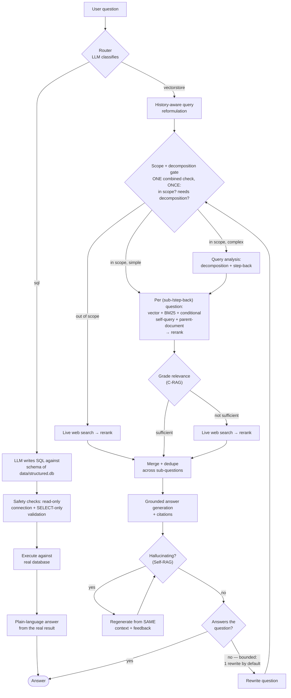
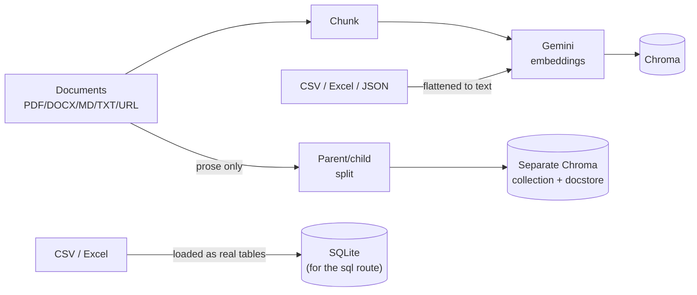

# RAG Engine

A complete implementation of the modern "advanced RAG" architecture — not a
single embed-and-retrieve demo, but the full set of techniques that separate a
production-shaped retrieval system from a tutorial: query construction,
query analysis, logical routing, multi-representation indexing, and
corrective generation. Built with LangChain and Gemini (Google AI Studio or
Vertex AI), with two real, independent ingestion pipelines (unstructured
documents and structured data) and two independent query paths (RAG and
text-to-SQL) unified behind one router.

Every technique below was verified against real ingested documents, not just
unit tests — several of those verifications surfaced genuine bugs (a
rerank-scope bug that silently dropped half of a compound answer, a Chroma
multi-client race condition, an ingestion pipeline that was silently
duplicating the entire store, two LangChain dependency/compatibility issues)
that got found and fixed along the way, not just theorized about. This file
covers what the project is and how to run it; **[ENGINEERING.md](ENGINEERING.md)
has the full depth** — every technique explained in detail, the real bugs
found and how they were verified fixed, and the performance/latency work,
with real before/after numbers throughout.

## What this covers

| Architecture area | Implemented | Deliberately skipped |
|---|---|---|
| **Query Construction** | Text-to-SQL (real DB, two independent safety guards) · Self-query retrieval (auto-extracted metadata filters) | Text-to-Cypher — no graph DB in this project |
| **Query Analysis** | Decomposition (compound → atomic sub-questions) · Step-back prompting (broader context question) | — |
| **Routing** | Logical routing (LLM classifies vectorstore vs. SQL, grounded in the real DB schema) | — |
| **Indexing** | Parent-document retrieval (precise child-chunk match, full-context parent-chunk return) | RAPTOR (hierarchical clustering/summarization) — high effort, poor fit for this corpus size |
| **Reasoning/Generation** | Corrective RAG (grade retrieval relevance → conditional web fallback) · Self-correcting generation (grade the *answer* — hallucination + does-it-actually-answer checks — regenerate or rewrite-and-retry) | — |

Skipped items are noted rather than hidden: each was a genuine effort/value
call, not an oversight — see
[ENGINEERING.md's Notes on design choices](ENGINEERING.md#notes-on-design-choices).

Two more pieces sit alongside this table rather than in it — they weren't
part of the original architecture, but grew out of using it against real
data: a **source catalog** (one auto-generated, cached sentence describing
what each ingested source covers) and a **scope gate** built on top of it
(skips local retrieval entirely for a question clearly unrelated to
anything ingested, before Corrective RAG would otherwise have to catch it
the more expensive way). See
[ENGINEERING.md's Source catalog](ENGINEERING.md#source-catalog) and
[Scope gate](ENGINEERING.md#scope-gate) sections.

## How it works

A question comes in through one interface (CLI or API/web UI) and is
**routed** to one of two independent paths:

- **RAG over documents**: the question is rewritten in light of conversation
  history, then passes one cheap combined **scope + decomposition check** —
  does it plausibly relate to anything actually ingested, per a one-sentence
  auto-generated **source catalog**, and would it benefit from being
  **decomposed** into atomic sub-questions plus one broader **step-back**
  question? (Both are one structured-output LLM call, not two — see
  [Scope gate](ENGINEERING.md#scope-gate).) Clearly out of scope skips
  straight to web search; simple and in-scope skips decomposition and
  retrieves once; complex and in-scope decomposes first. Either way it's
  retrieved through a hybrid of vector similarity, BM25 keyword search,
  **self-query** metadata filtering, and **parent-document** retrieval, then
  reranked by a local cross-encoder — per (sub-)question when there is
  more than one, not once against the combined question (see
  [Query analysis](ENGINEERING.md#query-analysis) for why that distinction
  is load-bearing, not academic). The retrieved context is then
  **graded for relevance**; only if it falls short does the system fall back
  to a live web search, instead of either guessing or refusing. Results are
  merged, deduplicated, and answered with inline citations grounded in real
  source metadata, not guessed from surface text. The generated answer is
  then graded a second time, on the *answer itself* rather than what was
  retrieved: is it actually grounded in the context (no hallucination), and
  does it actually address the question? A hallucinating answer gets
  regenerated with feedback; an answer that doesn't resolve the question
  triggers a question rewrite and a fresh retrieval pass — see
  [Self-correcting generation](ENGINEERING.md#self-correcting-generation).
- **Text-to-SQL**: for questions that need computation (counts, sums,
  rankings) rather than lookup, the LLM writes and executes a real SQL query
  against a real, read-only, validated database instead of retrieving
  pre-embedded text — so these questions get correct numeric answers instead
  of "I don't know," which is the actual ceiling of a text-only vector store.

## Feature summary

- **Multi-format ingestion** — PDF, DOCX, TXT, Markdown, and web pages, plus
  **CSV, Excel, and JSON** (structured data, converted row-by-row into
  retrievable text).
- **Hybrid retrieval** — dense vector search (MMR for diversity) fused with
  BM25 keyword search, self-query retrieval, and parent-document retrieval
  via reciprocal rank fusion, so exact terms (IDs, error codes, names) aren't
  lost to pure semantic similarity.
- **Parent-document retrieval** — small chunks get embedded and matched (so
  retrieval stays precise), but the larger chunk they belong to is what
  actually gets returned, so a multi-step procedure split across several
  small chunks doesn't get returned as an incomplete fragment.
- **Self-query retrieval, grounded in what sources actually cover** — an LLM
  splits a question like "what does the academic calendar say about
  November?" into a semantic search ("November") plus a structured metadata
  filter (`source == "...Calendar...pdf"`) it never had to be told
  explicitly, and skips itself entirely when the question shares no
  vocabulary with any known source.
- **A source catalog, generated once and reused** — a one-sentence,
  LLM-written description of every ingested source, persisted to disk so
  it's never regenerated for content that hasn't changed. Powers both
  self-query's filtering and the scope gate below.
- **A scope gate in front of retrieval** — before running the full local
  retrieval pass, a cheap check asks whether the question plausibly relates
  to anything ingested at all; if it clearly doesn't, the system skips
  straight to web search.
- **Web search, used correctively** — a live Tavily search backs the system
  up, but only when local retrieval actually fails to clear a relevance bar;
  it isn't spent on every query regardless of whether local docs already
  answer it.
- **Cross-encoder reranking** — a local `sentence-transformers` cross-encoder
  re-scores retrieved candidates before they reach the LLM, cutting noise out
  of the context window without an extra API call.
- **Corrective RAG (C-RAG)** — retrieved documents are graded for relevance
  before generation; only if they don't clear the bar does the system fall
  back to a live web search, instead of always answering from whatever the
  first retrieval pass returned.
- **Self-correcting generation (Self-RAG/RRR)** — the generated *answer* is
  graded too, not just what was retrieved: a hallucination check and a
  does-it-actually-answer-the-question check. A hallucinating answer gets
  regenerated with explicit feedback; an answer that doesn't resolve the
  question triggers a question rewrite and a fresh retrieval pass.
- **Text-to-SQL** — for structured data, a second query path lets the LLM
  write and run real SQL against a real database instead of retrieving
  pre-embedded text, so aggregate/computational questions ("which subject has
  the most sections?") get correct answers instead of no answer at all.
- **Logical routing** — a single chat interface, not three separate tools:
  each question is classified as a document lookup or a structured/
  computational question and dispatched to the RAG path or the text-to-SQL
  path accordingly.
- **Query analysis (decomposition + step-back)** — a compound question gets
  split into atomic sub-questions, each retrieved and reranked on its own
  merits, instead of one half silently winning the single retrieval pass; a
  broader "step-back" question is also generated and retrieved for
  background context — both skipped automatically for an already-simple
  question.
- **Conversational memory** — multi-turn chat with a history-aware retriever,
  so follow-up questions ("what about the second one?") resolve correctly.
- **Source citations, actually grounded in metadata** — each retrieved passage
  is tagged with its real filename/URL *before* the LLM ever sees it, so
  citations name the passage's real source instead of guessing from surface
  text. The API also returns the list of sources retrieved.
- **Evaluation harness** — [RAGAS](https://github.com/explodinggradients/ragas)
  metrics (faithfulness, answer relevancy, context precision/recall) against a
  small labeled question set, so retrieval/generation quality is measurable,
  not just vibes.
- **Three interfaces** — a CLI, a FastAPI backend with session management, and
  a plain HTML/CSS/JS web UI with real per-stage progress reporting, all
  served from one process.

See [ENGINEERING.md](ENGINEERING.md) for how each of these actually works,
what real data verified it, and what real bugs got found and fixed building
them.

## Architecture





Every chunk/document id is deterministic (hashed from source + content), so
re-ingesting the same file **upserts in place instead of duplicating** — see
[ENGINEERING.md's Notes on design choices](ENGINEERING.md#notes-on-design-choices)
for the real duplication bug this fixed.

## Setup

```bash
python -m venv .venv
.venv\Scripts\activate        # Windows
pip install -r requirements.txt
copy .env.example .env        # then add your GOOGLE_API_KEY
```

Two ways to authenticate — pick one in `.env` via `LLM_PROVIDER`:

- **`genai`** (default) — Google AI Studio, a simple API key. Get one free at
  https://aistudio.google.com/apikey. Note: in some regions the free tier
  requires billing to be linked on the AI Studio project before it'll serve
  requests, even though usage itself stays free under quota.
- **`vertexai`** — Google Cloud Vertex AI, authenticated with a service-account
  JSON key (`GOOGLE_APPLICATION_CREDENTIALS`) and billed against a GCP
  project/billing account (e.g. a student credit) instead of AI Studio's free
  tier. Requires the Vertex AI API enabled on that project
  (console.cloud.google.com → APIs & Services → enable "Vertex AI API").
  Set `VERTEX_PROJECT_ID` and `VERTEX_LOCATION` accordingly. Keep the
  credentials file **outside the repo** (e.g. in your home/Downloads folder)
  and only reference it by path — never commit it.

## Usage

Drop your own PDFs/DOCX/MD/CSV/Excel/JSON files into `data/raw/`, or ingest
URLs, then index everything:

```bash
python cli.py ingest
python cli.py ingest --urls https://example.com/some-doc
```

If you also have structured data you want to *compute over* (counts, sums,
rankings — see [Text-to-SQL](ENGINEERING.md#text-to-sql)), build the
queryable database too:

```bash
python cli.py build-sql-db
```

Chat from the terminal — every question is automatically routed to whichever
path can actually answer it (see [Routing](ENGINEERING.md#routing)):

```bash
python cli.py chat
```

Or run the API — which also serves the web UI, same process, same port:

```bash
uvicorn api.main:app --reload
```

Open `http://localhost:8000` for the chat UI, or hit the endpoints directly:

```
POST /ingest        {"urls": ["https://..."]}      # optional; also re-scans data/raw
POST /query         {"question": "...", "session_id": "..."}   # session_id optional; response includes "route"
POST /query/stream  same, but streams real progress as newline-delimited JSON (used by the web UI)
GET  /health
DELETE /session/{session_id}
GET  /              the web UI (static/)
```

The UI ([`static/`](static/)) is plain HTML/CSS/JS — no framework, no build
step, no npm — mounted by FastAPI itself, same origin as the API (no
base-URL/CORS config needed), with real per-stage progress (not a fake
timer) and a session that survives a page refresh. See
[ENGINEERING.md's Web UI section](ENGINEERING.md#web-ui-internals) for how
the streaming progress actually works, why an earlier Streamlit version was
replaced, and a real concurrency bug found running it live.

## Tests

```bash
pytest
```

Ingestion/chunking/SQL-safety tests run without an API key against small
synthetic fixtures in `tests/fixtures/` — never against whatever real
documents happen to be in `data/raw/`. The end-to-end pipeline test requires
`GOOGLE_API_KEY` and is skipped otherwise; the web search test mocks the
Tavily call, so it needs no key or network access either.

## Project layout

```
src/
  ingestion/
    loaders.py            text loaders (pdf/docx/txt/md), dispatch by extension
    structured_loaders.py CSV/Excel/JSON/SQL → row-level Documents (for the vector store)
    sql_builder.py         CSV/Excel → real SQLite tables (for text-to-SQL)
    chunking.py             recursive text splitting, deterministic chunk ids
  rag/
    vectorstore.py     Chroma + Gemini embeddings; shared PersistentClient (get_chroma_client)
    retrieval.py       hybrid retrieval (vector + BM25 + self-query + parent-doc) + per-sub-question reranking
    web_search.py      Tavily web search as a BaseRetriever (fallback only, see corrective.py)
    self_query.py      auto-extracted metadata filters (SelfQueryRetriever), conditional
    source_catalog.py  one-sentence LLM description per source, persisted/cached
    scope_gate.py      cheap upfront check: skip local retrieval if clearly out of scope
    parent_document.py small-chunk-match/large-chunk-return indexing (ParentDocumentRetriever)
    corrective.py      Corrective RAG: relevance grading + conditional web fallback
    self_correction.py Self-RAG/RRR: grades the ANSWER — hallucination + answers-question checks
    query_analysis.py  query decomposition + step-back prompting (DecomposingRetriever), conditional
    chain.py           conversational RAG chain (LangChain LCEL); also exposes document_chain alone
    text_to_sql.py     LLM writes + safely executes real SQL
    router.py          classifies each question: vectorstore vs. sql
    pipeline.py        ingest + ChatSession orchestration (routes + dispatches), progress callbacks
api/main.py           FastAPI backend, also serves static/ (the web UI)
static/                plain HTML/CSS/JS chat UI, calls the API via fetch()
cli.py                 CLI entrypoint (ingest / chat / build-sql-db / sql)
scripts/evaluate.py    RAGAS evaluation
```

See [ENGINEERING.md](ENGINEERING.md) for the full technique-by-technique
deep dive, every real bug found along the way, the evaluation results, and
the performance/latency work.
